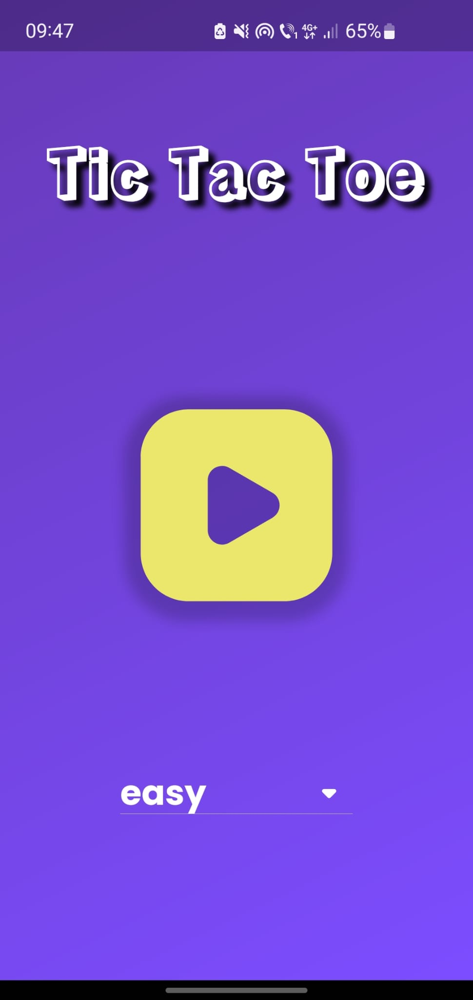
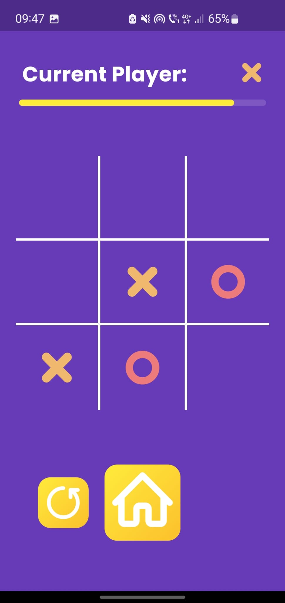
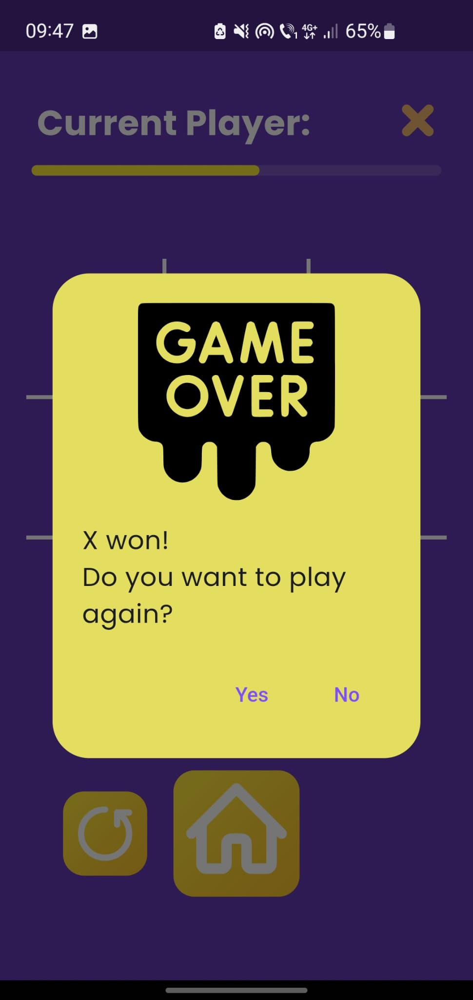

# Tic Tac Toe Flutter UI

## Overview

Tic Tac Toe Flutter UI is a cross-platform mobile app developed using Flutter, allowing users to play the classic Tic Tac Toe game. The app features different game modes, including easy, medium, hard AI levels, and a mode to play against a friend. The start page provides options for selecting the game mode and initiating the game.

  
  
  

## Motivation

This project was created as a learning exercise during an internship to explore the Flutter framework and Dart language. It serves as the developer's first Flutter app, aimed at gaining practical experience in app development and understanding the Flutter ecosystem.

## Features

- **Start Page**: Navigate through the start page to select the desired game mode and begin playing.
- **Multiple Game Modes**: Choose from easy, medium, or hard AI levels, or play against a friend.
- **Minimax Algorithm**: In the hard mode, the computer opponent employs the Minimax algorithm, making it unbeatable. This algorithm ensures optimal moves for the computer player, providing a challenging gameplay experience.
- **Flutter Bloc and GetIt Integration**: Utilizes Cubits from the flutter_bloc package and GetIt for state management and dependency injection.
- **Custom Dart Library**: Implements a Dart library for game logic, providing a modular and reusable solution.
- **Unit Tests**: Includes tests for game logic using the flutter test framework.

## Getting Started

To run the Tic Tac Toe Flutter UI app, follow these steps:

1. Clone the repository to your local machine.
2. Ensure you have Flutter installed on your system. If not, refer to the [Flutter installation guide](https://flutter.dev/docs/get-started/install) for instructions.
3. Open the project directory in your preferred code editor.
4. Run `flutter pub get` to install the project dependencies listed in the `pubspec.yaml` file.
5. Connect a device/emulator to your development environment.
6. Run the app using `flutter run`.

## Contributing

Contributions to Tic Tac Toe Flutter UI are welcome! If you have suggestions for improvements, find any bugs, or would like to contribute new features, please feel free to open an issue or submit a pull request.
